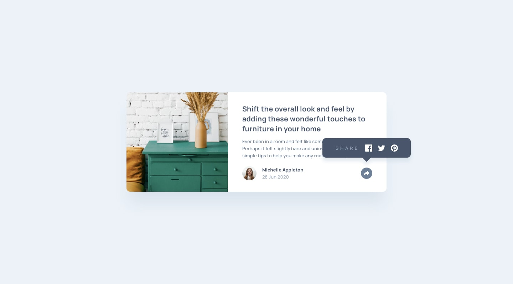

# Frontend Mentor - Article preview component solution

This is a solution to the [Article preview component challenge on Frontend Mentor](https://www.frontendmentor.io/challenges/article-preview-component-dYBN_pYFT). Frontend Mentor challenges help you improve your coding skills by building realistic projects.

## Table of contents

  - [The challenge](#the-challenge)
  - [Screenshot](#screenshot)
  - [Links](#links)
- [My process](#my-process)
  - [Built with](#built-with)
- [Author](#author)

### The challenge

Users should be able to:

- View the optimal layout for the component depending on their device's screen size
- See the social media share links when they click the share icon

### Screenshot

### Links

- Solution URL: [Solution](https://github.com/Omeshcoding/Preview-component)
- Live Site URL: [Live site ](https://omeshcoding.github.io/Preview-component/)

## My process

### Built with

- Semantic HTML5 markup
- CSS custom properties
- Flexbox
- Desktop-first workflow

## Author

- Website - [Umesh Protfolio](https://umesharma.netlify.app/)
- Frontend Mentor - [@Omeshcoding](https://www.frontendmentor.io/profile/Omeshcoding)
- Twitter - [Umesh Sharma](https://twitter.com/Omesha_Sh)

